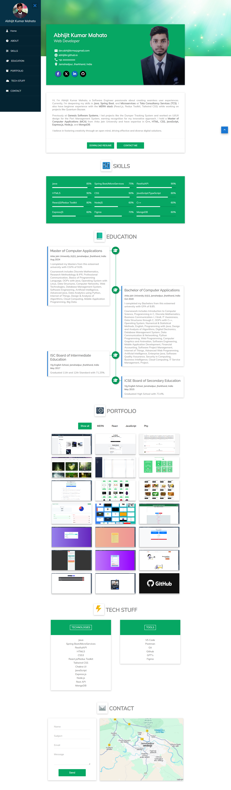

# Portfolio Website Documentation - [Visit Now](https://abhijitkr.github.io)

Welcome to the documentation for my portfolio website project! This README provides an overview of the project, its purpose, technologies used, key integrations, available sections, and how to access the source code.

## Project Overview

My portfolio website is designed and developed to showcase my projects, skills, and experience in a professional and engaging manner. It serves as a central hub for visitors to learn more about my work and get in touch with me.

## Technologies Used

The portfolio website is built using the following technologies:

- **HTML**: For structuring the content of the website.
- **CSS**: For styling and layout of the web pages.
- **JavaScript**: For adding interactivity and dynamic features.
  
## Key Integrations

The website integrates various libraries and tools to enhance its functionality and design:

- **Google Fonts**: For incorporating custom fonts and typography.
- **Font Awesome**: For adding scalable vector icons to the website.
- **Material Icons**: For including material design icons.
- **w3forms**: For creating and styling the contact form.
- **Aos Animation**: For implementing scroll animations to improve user experience.

## Responsive Design

The portfolio website is designed with a responsive layout, ensuring optimal viewing and interaction experience across a wide range of devices, including desktops, tablets, and mobile phones.

## Available Sections

The following sections are available on the portfolio website:

1. **Hero Section**: Introduction and welcome message.
2. **About Me**: Information about myself, including a link to download my resume.
3. **Skills**: Overview of my technical skills.
4. **Education**: Details about my educational background.
5. **Portfolio**: Showcase of my projects with buttons for navigation.
6. **Tech Stuff**: Information about the technologies used in the portfolio website.
7. **Contact**: Contact form and map for reaching out to me.

## Screen

## Source Code

The complete source code for the portfolio website is available in this GitHub repository. You can clone or fork the repository to explore the code and customize it according to your requirements.

## Accessing the Website

To visit the live version of the portfolio website, click [here](https://abhijitkr.github.io).

## Feedback and Contributions

Feedback, suggestions, and contributions to the project are welcome! Feel free to open an issue or submit a pull request if you have any improvements or ideas to share.

Thank you for your interest in my portfolio website!
